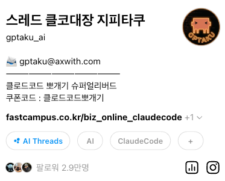

<!-- _class: banner -->

[ 무료 세미나 ]

# Claude Code Skills 뽀개기 : 검색 자동화부터 에이전트 팀 구축까지

By. <strong>지피타쿠</strong>

<!--
Speaker note (O1 · 00:00~01:00):
강의 때 이 배너 띄워놓고 이렇게 말씀해주세요 ↓

"안녕하세요. 무료 세미나 'Claude Code Skills 뽀개기' 시간에 함께해 주셔서 감사합니다.
오늘 이 1시간이 어떤 시간일지, 한 줄로 먼저 말씀드릴게요.

제 2년 삽질, 오늘 1시간에 다 가져가세요.

그게 오늘의 약속입니다. 입문에서 에이전트 팀 구축까지 — 치트키 압축본으로 준비했어요.
끝나고 나면 '아 이거 미리 알았으면' 싶은 것만 모아왔습니다.

자, 시작할게요."

(35~40초. 마이크 체크 + 가벼운 인사 후 바로 약속 선언. 자기 말에 심취 금지.)
-->

---

<!-- _class: hero -->

  

# 클코대장 **지피타쿠** — 이철로

- 현) **AX with** — AX 컨설팅 & AI 교육
- 현) **CC101** (cc101.axwith.com) 가이드 제작·배포로 일반인·비개발 직무의 Claude Code 활용 지원
- 현) **1인 개발자** — AI 기반 서비스
- 전) **R&D 기계 엔지니어 10년** GENTLE MONSTER · LG INNOTEK

<!--
Speaker note (O2 · 01:00~02:00):
- 이력 읽기 말고 핵심만: "원래 10년 기계엔지니어였고, 지금은 1인 개발자 + AI 교육"
- "본업보다 스레드 클코대장이 더 유명해졌습니다" (웃음 포인트)
- 40~50초.
-->

---

<!-- _class: screenshot -->

  

    
    
    
    ~ /  —  claude-code
  

  

    
Welcome to Claude Code

    
Type a message, or type / for commands.

    
&nbsp;

    
────────────────────────────────────────────────────────────

    
&nbsp;

    
&gt; 

    
&nbsp;

    
&nbsp;

    
? for shortcuts     ctrl+c to exit     shift+tab to switch mode

  

— 처음 Claude Code 실행했을 때 딱 이 화면이에요.

<!--
Speaker note (O3 · 02:00~02:45):
강의 때 이 화면 띄워놓고 이렇게 말씀해주세요 ↓

(3초 정적, 화면 보여주기)

"보이시죠? 클로드 코드 실행하면 딱 이 화면이 떠요. 검은 창, 깜빡이는 커서, 뭘 쳐야 할지 모르겠는 프롬프트.

솔직히 말씀드리면, 저 이 화면 처음 봤을 때 발작부터 했거든요.

(웃음 포인트. 살짝 웃어주기)

강사가 이런 말을 해도 되나 싶으시죠? 근데 진짜예요."

(40초. 의외성 찌르기 → 3초 멈춤 → 참가자 "왜?" 던지게 만듦)
-->

---

<!-- _class: beforeafter -->

<s>정석</s>

치트키

평생 '정석' 말고 <strong>'치트키'</strong>만 찾던 사람이에요. 
근데 <strong>AI 앞에선, 그 전략이 안 먹히더라고요.</strong>

<!--
Speaker note (O4 · 02:45~03:45):
- "수능 때도 저는 정석 강사 안 듣고 사파 강사만 골랐어요. 그 전략이 항상 통했어요"
- "근데 AI 앞에 서니까 그 전략이 안 먹혔어요. 전공도 아니고, 뭐가 맞는지 모르겠고"
- 이 슬라이드는 1분. 수능 에피소드는 스쳐가듯.
-->

---

<!-- _class: wandering -->

  
replit

  
lovable

  
v0

  
readdy

  
cursor

  
그 외 전부

### 터미널은 **딴 세상** 이거면 충분하다 싶었어요

저 <strong>평생 Windows만</strong> 쓰던 사람이라, 검은 창에 뭐 친다? 그게 아예 상상 밖이었거든요.

<!--
Speaker note (O5 · 03:45~05:00):
강의 때 이 슬라이드 보면서 이렇게 풀어주세요 ↓

"제가 AI로 작업하기 시작하면서 처음엔 재밌었어요. 그러다 바이브코딩 단계 넘어가려니까, 아 이건 좀 어려운 것 같은데 싶은 생각이 들더라고요.
그래서 찾은 게 이런 AI Builder들이에요. replit, lovable, v0, ready. 말 그대로 안 써본 게 없어요.
왜 이것들만 고집했냐면 — 저, 개발자 아니거든요. 그리고 평생 Windows만 쓴 사람이에요.
Mac 쓰는 분들은 터미널 친숙하실 텐데, Windows 유저는 그냥 창만 뜨면 되는 거잖아요.
검은 창 하나 놓고 뭘 계속 친다? 그게 상상도 안 되는 거예요.
그래서 이 AI Builder들만 쓰면서 합리화했어요. '나한텐 이게 맞을 거야', '저건 개발자나 쓰는 거지', '내 일엔 이거로 충분해' 라고요.
그런 제가 클로드 코드 처음 봤을 때? 말해 뭐 해요. 보고 바로 발작부터 했죠."

(40대 Windows 유저 공감 포인트. 1분 15초 분량.)
-->

---

<!-- _class: peak -->

커서로 끝까지 버티다가요.

# 넘어오자마자 후회했어요.

이거 하나 안 쓰겠다고, 몇 달을 <strong>그냥 날렸더라고요.</strong>

<!--
Speaker note (O6 · 05:00~06:15) ★ 감정 피크:
- ★ 가장 천천히 읽기.
- "지금 이 문장, 제가 2026년 3월에 스레드에 올린 글에서 그대로 가져온 겁니다"
- '도태됐구나' 앞에서 3초 멈춤.
- 오프닝 전체에서 유일하게 느려지는 구간.
- 75~80초.
-->

---

<!-- _class: compare -->

### 지피타쿠

**2년**

GPT-3.5 시대부터 
모델 하나하나 쫓아오며

→

### 여러분

**한두 달**

이미 클로드코드 
완성된 시점에 시작

지피타쿠의 <strong>2년</strong>이 여러분한텐 <strong>한두 달</strong>이에요. 
그래서 오늘 여기 왔어요.

<!--
Speaker note (O7 · 06:15~07:30):
- "이 문장 그대로 3월에 스레드에 올렸어요. '나같은 삽질하지 마라고 치트키 알려주는 거야'"
- 오프닝의 회복 구간. O6에서 내려간 감정을 다시 끌어올림.
- 1분 10초.
-->

---

<!-- _class: roadmap -->

# 클코대장의 치트키 압축본

  

    
SESSION 1

    
GPTaku Plugin

    
플러그인 소개

    
10 min

  

  

    
SESSION 2

    
Skill 만들기

    
커머스 검색 스킬

    
15 min

  

  

    
SESSION 3

    
Agent Teams

    
kkirikkiri 트렌드 리포트

    
15 min

  

자, 바로 갑니다 →

<!--
Speaker note (O8 · 07:30~10:00):
- 오프닝의 착지 구간. 차분하게.
- "Session 1은 GPTaku Plugin이 뭔지 10분 안에 싹 보여드릴 거고, 그 다음 실습 두 번 갑니다"
- "결론부터 말하면 오늘 여러분은 쿠팡 상품 검색 Skill을 만드실 거고,
   그 Skill이 에이전트 팀에 들어가서 트렌드 리포트를 쓰는 걸 보실 겁니다"
- 1분 30초 ~ 2분.
-->

---

<!-- _class: title -->

# Session 1 **GPTaku Plugin 소개**

## 클코대장의 치트키 상자, 지금 열어드려요

<!--
Speaker note (S1-1 · 20:10~20:10:30):
- 30초짜리 트랜지션. 빠르게 넘김.
-->

---

<h1 class="wall-title">Claude Code 쓸 때, 부딪히는 벽</h1>

  

    
🚧

    
세팅

    
"뭐부터 쳐야 하지?"

  

  

    
🚧

    
용어

    
"에이전트? MCP? 훅? 서브에이전트?"

  

  

    
🚧

    
레시피

    
"만들고 싶은 건 있는데, 어떻게 만들지 모르겠어."

  

저도 이 순서대로, 다 겪었어요.

<!--
Speaker note (S1-2 · 20:10:30~20:12):
강의 때 슬라이드 보면서 이렇게 풀어주세요 ↓

"제가 입문자들 많이 만나봤는데, 비개발자가 Claude Code 처음 쓸 때 딱 세 군데서 벽에 부딪힙니다.

첫 번째, **세팅**. 설치는 했는데 텅 빈 터미널 앞에서 뭘 해야 할지 모르겠어요. 뭐부터 쳐야 하지?

두 번째, **용어**. 에이전트, 서브에이전트, MCP, 플러그인… 뭐가 뭔지 구분이 안 돼요. 검색해봐도 설명이 다 달라요.

세 번째, **레시피**. 재료는 많아요. 커맨드도 있고, 스킬도 있고, 훅도 있어요. 근데 이걸 언제 어떻게 섞어 쓰는지는 아무도 안 알려줘요.

저도 이거 다 겪었어요. 그것도 정확히 이 순서대로."

(공감 포인트 3개. 1분 30초.)
-->

---

<!-- _class: peak -->

GPTaku Plugin

# 방금 본 벽 3개, <strong>플러그인이 뚫어드려요.</strong>

설치 한 줄 → 입문자 벽 바로 건너뜁니다.

<!--
Speaker note (S1-3 · 20:12~20:14):
강의 때 이 피크 보여주고 이렇게 풀어주세요 ↓

"방금 보셨던 벽 세 개 — 세팅·용어·레시피.

이거 하나하나 처음부터 뚫으려면 저처럼 몇 달씩 걸려요.
근데 누군가 이미 뚫어놓고, 다 쓸 수 있게 정리해놨다면?

그게 GPTaku Plugin이에요.

세팅 막히는 분들 위해 미리 세팅해둔 기본값 →
용어 혼란스러운 분들 위해 자주 쓰는 패턴 스킬로 →
레시피 모르는 분들 위해 '언제 뭘 쓸지' 스킬 단위로 묶음 →

설치 한 줄이면, 입문자가 혼자 몇 달 삽질할 구간을 바로 건너뛰세요.

(작업환경 그대로 주는 게 아니라, '벽 넘는 도구 묶음'이라는 걸 분명히 전달)"

(1분 30초 ~ 2분.)
-->

---

<!-- _class: radial -->

GPTaku Plugin

  

    
insane-search

    
차단된 사이트도 자동 우회

  

  

    
kkirikkiri

    
자연어 한 마디로 AI 팀

  

  

    
deep-research

    
멀티 에이전트 딥리서치

  

  

    
skillers-suda

    
스킬 만드는 스킬

  

  

    
vibe-sunsang

    
내 AI 활용 점검

  

  

    
git-teacher

    
Git 자동화

  

  

    
insane-design

    
디자인 시스템 분석·적용

  

  

    
show-me-the-prd

    
한 문장 → PRD

  

  

    
pumasi

    
Codex 병렬 외주 개발

  

  

    
nopal

    
Google Workspace 오케스트레이션

  

  

    
docs-guide

    
공식 문서 자동 탐색

  

  

    
+ 계속 추가 중

  

★ 표시 두 개, 오늘 세미나에서 같이 써봅니다 →

<!--
Speaker note (S1-4 · 20:14~20:18):
강의 때 이 허브 보여주면서 이렇게 말씀해주세요 ↓

"이게 GPTaku Plugin 안에 들어있는 스킬들입니다. 총 11개. 지금도 계속 추가하는 중이고요.

여기 별 두 개 붙은 게 오늘 세미나에서 실제로 써볼 애들이에요.

insane-search — 쿠팡·네이버·링크드인 같이 일반 방법으로 막히는 사이트를 자동으로 뚫어주는 스킬.
kkirikkiri — 자연어로 한마디 던지면 AI 에이전트 팀을 알아서 구성해주는 스킬.

이 두 개만 봐도 Plugin이 뭐 하는 앤지 딱 감 잡으실 거예요.

자, Session 2 바로 들어갑시다 — 터미널 보여드릴게요."

(2분. 각 스킬 한 번씩 훑고 두 개 중점 강조 → Session 2로 직행.)
-->

---

<!-- _class: grid -->

# 오늘 1시간, 우리가 한 것

  

    
①

    
GPTaku Plugin

    
플러그인 소개 (Session 1)

  

  

    
②

    
Skill 만들기

    
커머스 검색 스킬 (Session 2)

  

  

    
③

    
Agent Teams

    
kkirikkiri 트렌드 리포트 (Session 3)

  

더도 말고 덜도 말고, 딱 이 3개.

<!--
Speaker note (C1 · 21:00~21:01):
- 감정 톤 차분하게. "정리하면 이 3개였죠"
- 50초.
-->

---

<!-- _class: peak -->

제가 진심으로 드리고 싶은 말.

# Claude Code, 꼭 한 번 써보세요.

&nbsp;

<!--
Speaker note (C2 · 21:01~21:03) ★ 클로징 피크:
화면 띄워놓고 이렇게 풀어주세요 (정적 한 번 깊게 → 천천히) ↓

"솔직히 말씀드릴게요.
(3초 정적)

제가 오늘 이 자리에서 드리고 싶은 딱 한 마디예요.

Claude Code, 꼭 한 번 써보세요.

(여기서 잠깐 멈추고)

강의는요... 솔직히 안 들으셔도 돼요. 제가 강의 팔려고 2년 삽질한 거 아니거든요.
제가 본 가능성을 여러분도 보셨으면 해서 여기 왔어요.

오늘 세미나에서 가능성 조금이라도 보셨다면 — 그걸로 충분합니다.
저처럼 '아, 이거 미리 썼으면' 하고 몇 달 날리지만 마세요.

스레드에서 저 지피타쿠로 찾으시면, 오늘보다 더 많은 이야기 있어요. 무료예요."

(1분 30초 ~ 2분. 최대한 천천히. O6 톤의 재현. '강의 안 들어도 된다'는 말로만 — 슬라이드엔 걸지 않음.)
-->

---

<!-- _class: offer -->

# 더 깊게 가고 싶으시면 본강의에 다 있어요.

  

    
PART 04

    
GPTaku Plugin 체험

    
설치 + 주요 스킬 4개 직접 써보기

  

  

    
PART 06 ★

    
스킬 만들기 9개

    
딥리서치·검색API·웹크롤·모닝브리핑·콘텐츠파이프라인…

  

  

    
PART 07

    
나만의 AI Agent

    
오픈클로 워크스페이스 + 콘텐츠 자동화 + 트렌드앱

  

  
🔥 당일 라이브 접속자 한정 · <strong>3만원 특별 할인</strong>

  
🎁 세미나 '신청자' 전원 · <strong>최대 할인 쿠폰</strong> <em>(Zoom에서 공개)</em>

<!--
Speaker note (C3 · 21:03~21:04:30):
- "오늘 본 거 세 가지, 본강의에선 Part 04/06/07에 깊이 들어있어요"
- 혜택 읽어주기 · 2번 강조. 쿠폰 코드 Zoom 채팅에 붙여넣기 예정
- 1분 30초.
-->

---

<!-- _class: thanks -->

# 감사합니다.

궁금한 거 있으면 언제든 스레드로.

  

    

    
📱 스캔 → 스레드

  

  

    @gptaku_ai Threads 
    @GPTaku X
  

  

    스레드 클코대장 지피타쿠 
    — 앞으로도 잘 부탁해
  

<!--
Speaker note (C4 · 21:04:30~21:05):
- Threads/X 핸들 읽어주기
- Q&A로 자연스럽게 바통 넘기기: "자 이제 남은 시간 궁금한 거 무엇이든 물어봐주세요"
- 30초.
-->
